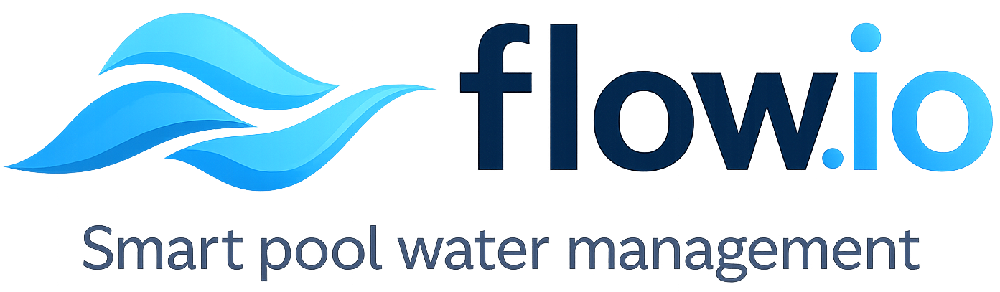

# flow.io

flow.io est une plateforme autonome permettant de gérer automatiquement votre piscine: elle automatise la gestion de la qualité de l'eau, réduit les opérations manuelles, et donne une supervision claire des équipements en local comme à distance.

  

## Pourquoi flow.io

Sans orchestration continue, on observe vite:
- dérive pH / ORP
- filtration mal dimensionnée par rapport à la température
- surconsommation de produits et d'énergie
- usure prématurée des pompes et actionneurs
- gestion complexe de l'hivernage

flow.io apporte un pilotage cohérent de bout en bout.

## Cartes matérielles supportées

flow.io peut fonctionner avec plusieurs cartes matérielles selon le niveau d'intégration recherché: carte au format PoolMaster pour une intégration complète dans l'écosystème historique, carte au format DIN pour une installation propre en coffret électrique, ou cartes industrielles prêtes à câbler.

La dernière version tire notamment profit de l'ESP32-S3 embarqué dans la carte [WAVESHARE ESP32-S3-ETH-8DI-8RO](https://www.waveshare.com/esp32-s3-eth-8di-8ro.htm). Cette carte industrielle regroupe 8 entrées digitales, 8 relais, Ethernet, Wi-Fi, Bluetooth LE, RS485, USB-C, alimentation large plage, protections d'isolation, borniers de câblage et boîtier ABS montable sur rail DIN. Elle inclut aussi une horloge temps réel PCF85063ATL, utile pour conserver l'heure et sécuriser les plannings lorsque le réseau ou le NTP ne sont pas disponibles. L'ensemble permet de construire une installation flow.io à prix abordable, dans un format compact avec une finition professionnelle.

## Surveillance et contrôle en continu

flow.io mesure l'état du bassin et pilote les équipements en continu pour maintenir l'eau stable, adapter la filtration et sécuriser les traitements.

Modes de désinfection supportés:
- `Chlore/Brome`: régulation PID temporelle sur sonde ORP, avec injection par pompe péristaltique, consigne redox, délai de stabilisation après démarrage filtration, sécurité pression et contrôle du niveau de cuve
- `Electrolyse`: pilotage d'un électrolyseur au sel, soit en suivi de consigne ORP avec hystérésis, soit sur plages fixes pendant la filtration, avec température minimale de sécurité et temporisation de démarrage
- `Oxygène actif liquide`: dosage volumétrique sans asservissement ORP, calculé à partir du volume du bassin, de la dose produit hebdomadaire, du facteur de charge, de la compensation température optionnelle, de l'heure principale de dosage et d'un fractionnement en 1, 2 ou 3 injections par semaine

Régulation automatique de température:
- consigne de chauffage avec hystérésis et relais chauffage dédié
- protocole de chauffage assisté qui lance d'abord la filtration pour obtenir une mesure fiable de température d'eau, puis décide de maintenir pompe et chauffage actifs
- cycles de sondage périodiques lorsque la pompe est arrêtée, avec arrêt automatique une fois la consigne atteinte
- blocage de sécurité si la pression ou la mesure de température ne sont pas cohérentes

Mesures effectuées:
- température de l'eau et de l'air
- pression de pompe
- pH
- ORP / redox
- niveau du bassin
- niveaux de cuves pH et désinfection
- compteur d'eau ou métriques de remplissage
- états, temps de marche, volumes injectés et historiques d'exploitation des équipements

Actionneurs supportés:
- pompe de filtration
- pompe doseuse pH, compatible pH- ou pH+
- pompe doseuse chlore/brome ou oxygène actif liquide
- électrolyseur au sel
- pompe robot
- pompe ou électrovanne de remplissage
- chauffage ou pompe à chaleur
- éclairage et relais auxiliaires

## Interface locale tactile

L'interface locale tactile offre une vue synthétique des mesures, états et commandes principales pour l'exploitation quotidienne au bord du bassin.

## Automatisation utile au quotidien

- calcul automatique de la fenêtre de filtration selon la température d'eau
- priorisation et interlock des actionneurs pour une sécurité totale
- gestion des plannings (jour/semaine/mois) persistante
- modes d'exploitation (auto, manuel, protection gel)
- supervision alarmes (pression, états critiques)

## Principe de régulation PID (pH / ORP)

flow.io implémente une régulation PID temporelle pour les pompes péristaltiques pH et ORP:
- calcul PID périodique (par défaut toutes les `30 s`)
- conversion de la sortie en durée d'activation `output_on_ms` bornée dans une fenêtre fixe (`window_ms`, typiquement `1 h`)
- commande ON/OFF dans la fenêtre: la pompe est active en début de fenêtre pendant `output_on_ms`

Si les conditions de sécurité ne sont pas réunies (filtration arrêtée, mode hiver, capteur indisponible, défaut pression, etc.), la sortie est remise à `0` et la pompe est coupée.

Détail complet de l'algorithme, des conditions d'activation et des topics runtime dans la documentation module:
- [PoolLogicModule](docs/modules/PoolLogicModule.md)

## Intégration et exploitation

- publication MQTT structurée (`cfg/*`, `rt/*`, `cmd`, `ack`)
- auto-discovery Home Assistant pour le contrôle sur Internet et les statistiques à long terme
- gestion via application mobile entièrement paramétrable (Home Assistant)
- intégration possible avec Jeedom/Node-RED/InfluxDB/Grafana via MQTT
- architecture modulaire robuste (FreeRTOS + services Core + EventBus + DataStore + ConfigStore/NVS)
- Mises en jour OTA en Wi-Fi

Résultat: une eau plus stable, une maintenance plus prévisible et une meilleure maîtrise des coûts d'exploitation.

## Documentation développeur

La documentation complète (architecture, services Core, flux EventBus/DataStore/MQTT, et fiche détaillée par module) est disponible ici:

- [Documentation complète](docs/README.md)
- [Protocole flow.io <-> Supervisor (I2C cfg/status)](docs/core/flow-supervisor-i2c-protocol.md)
- [Quality Gates Modules (notes + description des 10 points)](docs/core/module-quality-gates.md)

## Documentation utilisateur

- [Documentation utilisateurs (PDF)](docs/Documentation%20utilisateur.pdf)
